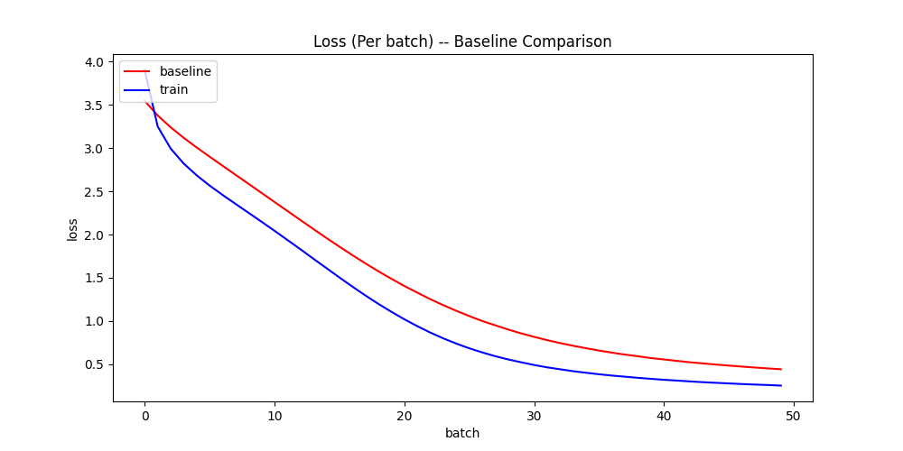

# Baseline
- This program is modified from [mymuise/gpt2-quickly](https://github.com/mymusise/gpt2-quickly)

## Comparison
- Modified the loss function and training procedure
- Comparison
    - `baseline_comparison`
    - With the same loss functions and trainning procedure, compare and generate comparison figure
    
