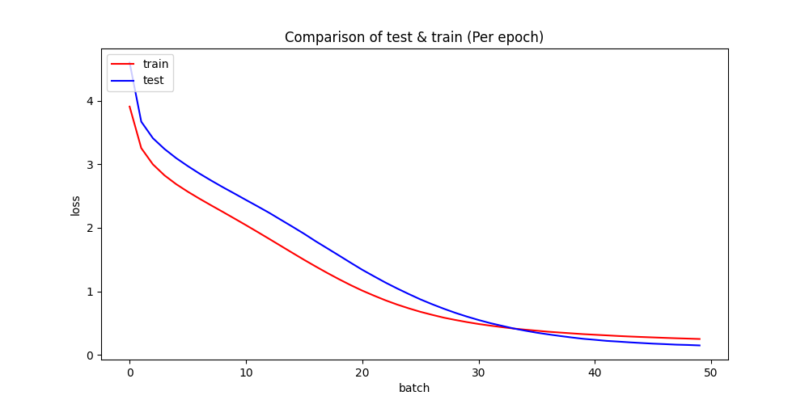
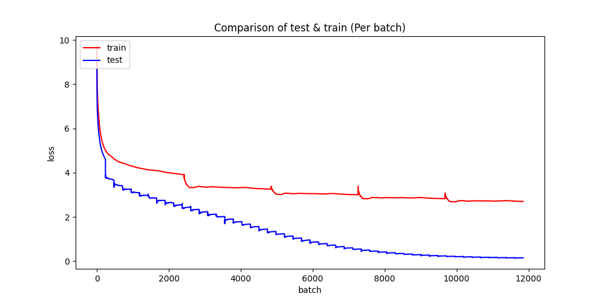
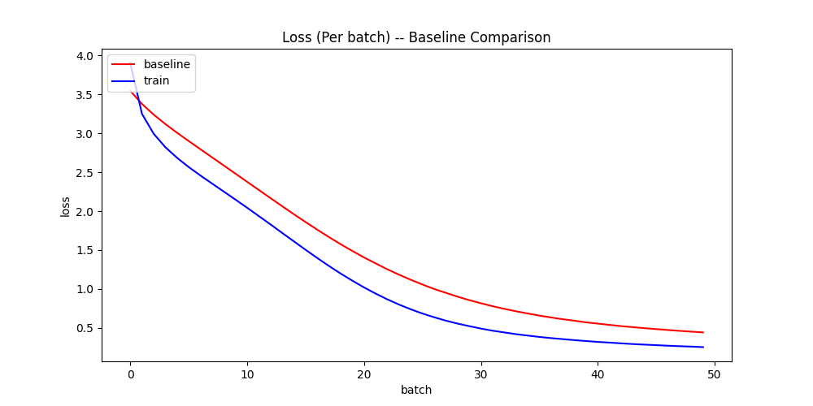

# Writing with AI

## Proposal

- NYCU 2022 spring AI Final Project

- The main proposal is to use the GPT-2 model trained & generating text

## Simple Use

- Download the release.

- Follow the step below to construct directories.

- Put files to the right position

- Train model

  ```shell
  python train.py
  ```

- Write with the model

	```shell
	python write.py [--dir <model_path>] [--max_len <expected_len>]
	```

## Code Structure

### Structure of Program

- Structure of the program


- files

  - `src/*`

    - `config.py`: Store program configuration and will be instantiated in `train.py` or anywhere it need to be called.

    - `model.py`: Including model initialize, train, save, visualize and log output. A combination of core functions.

    - `tokenization.py`: Use this to trained an BPE tokenizer.

      ```shell
      python tokenization.py
      ```

      > This need to be run if there are no corresponding tokenizer.

  - `train.py`

    - It will load tokenizer, build model, setup all project configuration and start training the module.

  - `write.py`

    - It can be used to generate text with existed models, which will stored in trained_model directory.

### Mkdir

- Some directories may need to be constructed before the program runs

  ```shell
  mkdir trained_data
  mkdir tokenized_data
  mkdir trained_model
  ```

  > make sure to put data willing to train under the trained_data directory

- An example structure with the provided pretrained model and put the data will be like.

  

  

### Modify the config

- Some codes may need to be modified for local use

- `train.py`

  ```python
  """ Metadata
  ...
  """
  # ...
  
  config = ProjectConfig(
  	...,
  	data_name="simplebooks-2"
  )
  ```

  > data_name can be modified

## Preprocessing

### BPE Tokenizer

- implement BPE tokenizer to pre-processing the text data

  - [Summary of the tokenizers (huggingface.co)](https://huggingface.co/docs/transformers/tokenizer_summary)
  - Aim's to translate between human-readable text and numeric indices
  - Indices will be mapped to word embeddings (numerical representations of words) -> This will be done by an embedding layer within the model. 

- Load the tokenizer

  - This Tokenizer will be loaded in model initialization

    ```python
    tokenizer = GPT2Tokenizer.from_pretrained(tokenizer_path)
    ```

## Training

### TFGPT2LMHeadModel

- Use `transformers` to construct GPT Model

### History

- Stored history object will be used to visualize the trainning history.
- Use `matplotlib.pyplot` to visualized data

### Validation

- Validify the train model with test model loss value 
- The train dataset is 10 times larger then the test dataset and there are no intersection of them
- A way to test and modify the hyper-parameters


> It can be found that the loss value have no fitting problem


> Since the training dataset is more larger than the test dataset, on the same number of batches, training model will have lower loss value


## Result

- This visualization result will be stored in `trained_model/figure/`
- Detail log output can be found in `media/detail_output.md`

### Text Generation


### Loss Value Per Epoch


### Loss Value Per Batch


## Performance
- Comparison the performence with other project, which is also training the GPT2 model

- The way to retrive the baseline parameter is described in the "baseline" branch


## Different Normalizer


## Reference

- [Text generation with GPT-2 - Model Differently](https://www.modeldifferently.com/en/2021/12/generación-de-fake-news-con-gpt-2/)

- [Transformers: State-of-the-art Machine Learning for Pytorch, TensorFlow, and JAX. (github.com)](https://github.com/huggingface/transformers)
- [TensorFlow API](https://www.tensorflow.org/api_docs/python/tf?hl=zh-tw)
- [Model training APIs (keras.io)](https://keras.io/api/models/model_training_apis/)
- [TFGPT2LMHeadModel (huggingface.co)](https://huggingface.co/docs/transformers/v4.19.4/en/model_doc/gpt2#transformers.TFGPT2LMHeadModel)
- [TFPreTrainedModel (huggingface.co)](https://huggingface.co/docs/transformers/v4.19.4/en/main_classes/model#transformers.TFPreTrainedModel)
- [tf.keras.callbacks.History  | TensorFlow Core v2.9.1](https://www.tensorflow.org/api_docs/python/tf/keras/callbacks/History)
- [tf.keras.callbacks.Callback  | TensorFlow Core v2.9.1](https://www.tensorflow.org/api_docs/python/tf/keras/callbacks/Callback)
- [Pipelines (huggingface.co)](https://huggingface.co/docs/transformers/v4.19.4/en/main_classes/pipelines#transformers.TextGenerationPipeline)
- [Difference between Sparse Cross Entropy and Categorical Cross Entropy](https://ithelp.ithome.com.tw/articles/10271081)

- [gpt2 · Hugging Face](https://huggingface.co/gpt2)
- [Visualize the hyperparameter tuning process (keras.io)](https://keras.io/guides/keras_tuner/visualize_tuning/)
- [python - How to disable printing reports after each epoch in Keras? - Stack Overflow](https://stackoverflow.com/questions/44931689/how-to-disable-printing-reports-after-each-epoch-in-keras)
- [Module: tf.keras.metrics  | TensorFlow Core v2.9.1](https://www.tensorflow.org/api_docs/python/tf/keras/metrics)
- [machine learning - What does from_logits=True do in SparseCategoricalcrossEntropy loss function? - Data Science Stack Exchange](https://datascience.stackexchange.com/questions/73093/what-does-from-logits-true-do-in-sparsecategoricalcrossentropy-loss-function)
- [How to add some new special tokens to a pretrained tokenizer?](https://github.com/huggingface/tokenizers/issues/247)

