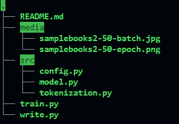
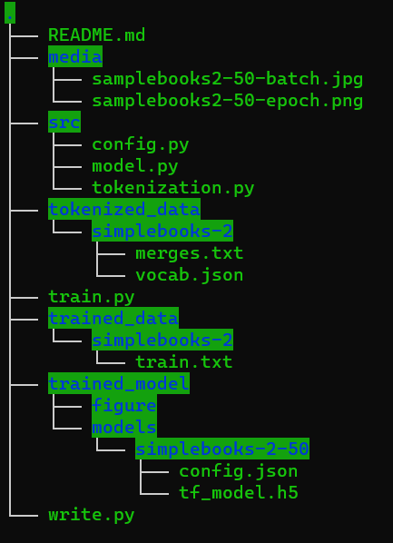
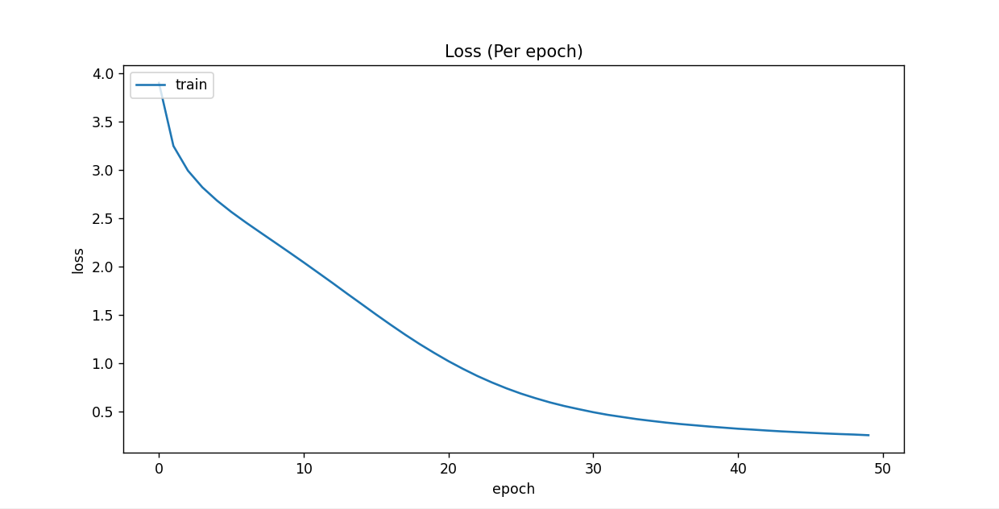
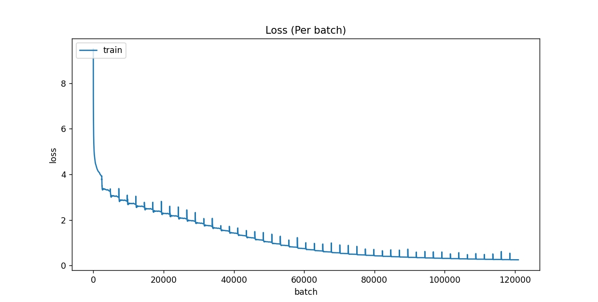
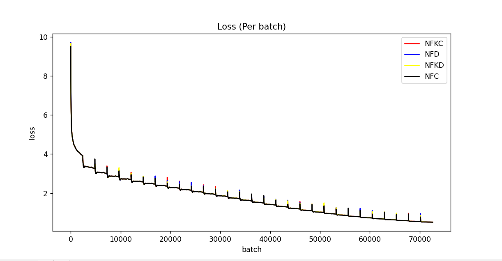

# Writing with AI

## Proposal

- NYCU 2022 spring AI Final Project

- The main proposal is to use the GPT-2 model trained & generating text

## Simple Use

- Download the release.

- Follow the step below to construct directories.

- Put files to the right position

- Train model

  ```shell
  python train.py
  ```

- Write with the model

	```shell
	python write.py [--dir <model_path>] [--max_len <expected_len>]
	```

## Code Structure

### Structure of Program

- Structure of the program



- files

  - `src/*`

    - `config.py`: Store program configuration and will be instantiated in `train.py` or anywhere it need to be called.

    - `model.py`: Including model initialize, train, save, visualize and log output. A combination of core functions.

    - `tokenization.py`: Use this to trained an BPE tokenizer.

      ```shell
      python tokenization.py
      ```

      > This need to be run if there are no corresponding tokenizer.

  - `train.py`

    - It will load tokenizer, build model, setup all project configuration and start training the module.

  - `write.py`

    - It can be used to generate text with existed models, which will stored in trained_model directory.

### Mkdir

- Some directories may need to be constructed before the program runs

  ```shell
  mkdir trained_data
  mkdir tokenized_data
  mkdir trained_model
  ```

  > make sure to put data willing to train under the trained_data directory

- An example structure with the provided pretrained model and put the data will be like.

  

  

### Modify the config

- Some codes may need to be modified for local use

- `train.py`

  ```python
  """ Metadata
  ...
  """
  # ...
  
  config = ProjectConfig(
  	...,
  	data_name="simplebooks-2"
  )
  ```

  > data_name can be modified

## Preprocessing

### BPE Tokenizer

- implement BPE tokenizer to pre-processing the text data

  - [Summary of the tokenizers (huggingface.co)](https://huggingface.co/docs/transformers/tokenizer_summary)
  - Aim's to translate between human-readable text and numeric indices
  - Indices will be mapped to word embeddings (numerical representations of words) -> This will be done by an embedding layer within the model. 

- Load the tokenizer

  - This Tokenizer will be loaded in model initialization

    ```python
    tokenizer = GPT2Tokenizer.from_pretrained(tokenizer_path)
    ```

## Trainning

### TFGPT2LMHeadModel

- Use `transformers` to construct GPT Model

### History

- Stored history object will be used to visualize the trainning history.
- Use `matplotlib.pyplot` to visualized data

## Result

- This visualization result will be stored in `trained_model/figure/`

### Loss Value Per Epoch



```
## Loss (Per Epoch)    ##
        Epoch 0 -> Loss: 3.903648853302002
        Epoch 1 -> Loss: 3.2500603199005127
        Epoch 2 -> Loss: 2.9946632385253906
        Epoch 3 -> Loss: 2.821579933166504
        Epoch 4 -> Loss: 2.6852798461914062
        Epoch 5 -> Loss: 2.5663347244262695
        Epoch 6 -> Loss: 2.4579238891601562
        Epoch 7 -> Loss: 2.3542587757110596
        Epoch 8 -> Loss: 2.251448154449463
        Epoch 9 -> Loss: 2.148042678833008
        Epoch 10 -> Loss: 2.043449878692627
        Epoch 11 -> Loss: 1.9365277290344238
        Epoch 12 -> Loss: 1.8293315172195435
        Epoch 13 -> Loss: 1.719415307044983
        Epoch 14 -> Loss: 1.6119022369384766
        Epoch 15 -> Loss: 1.5034215450286865
        Epoch 16 -> Loss: 1.3979310989379883
        Epoch 17 -> Loss: 1.2955776453018188
        Epoch 18 -> Loss: 1.1981788873672485
        Epoch 19 -> Loss: 1.1070220470428467
        Epoch 20 -> Loss: 1.0202499628067017
        Epoch 21 -> Loss: 0.9405309557914734
        Epoch 22 -> Loss: 0.8663972020149231
        Epoch 23 -> Loss: 0.7998376488685608
        Epoch 24 -> Loss: 0.7391602993011475
        Epoch 25 -> Loss: 0.6846773028373718
        Epoch 26 -> Loss: 0.6370853781700134
        Epoch 27 -> Loss: 0.5935728549957275
        Epoch 28 -> Loss: 0.5558265447616577
        Epoch 29 -> Loss: 0.5230922102928162
        Epoch 30 -> Loss: 0.4917517602443695
        Epoch 31 -> Loss: 0.46451228857040405
        Epoch 32 -> Loss: 0.4422658681869507
        Epoch 33 -> Loss: 0.4201878607273102
        Epoch 34 -> Loss: 0.4020017683506012
        Epoch 35 -> Loss: 0.38453686237335205
        Epoch 36 -> Loss: 0.3693166971206665
        Epoch 37 -> Loss: 0.356445848941803
        Epoch 38 -> Loss: 0.3433244228363037
        Epoch 39 -> Loss: 0.33187514543533325
        Epoch 40 -> Loss: 0.3205644190311432
        Epoch 41 -> Loss: 0.31170225143432617
        Epoch 42 -> Loss: 0.3019041121006012
        Epoch 43 -> Loss: 0.29318127036094666
        Epoch 44 -> Loss: 0.28581875562667847
        Epoch 45 -> Loss: 0.27874401211738586
        Epoch 46 -> Loss: 0.27176862955093384
        Epoch 47 -> Loss: 0.26560863852500916
        Epoch 48 -> Loss: 0.260423868894577
        Epoch 49 -> Loss: 0.253560870885849
```


### Loss Value Per Batch



```
## Loss (Per Batch)    ##
        Batch 0 -> Loss: 9.497234344482422
        Batch 1000 -> Loss: 4.277572154998779
        Batch 2000 -> Loss: 3.9940218925476074
        Batch 3000 -> Loss: 3.3456242084503174
        Batch 4000 -> Loss: 3.321021318435669
        Batch 5000 -> Loss: 3.0202085971832275
        Batch 6000 -> Loss: 3.050510883331299
        Batch 7000 -> Loss: 3.0121395587921143
        Batch 8000 -> Loss: 2.8706321716308594
        Batch 9000 -> Loss: 2.873934030532837
        Batch 10000 -> Loss: 2.699038028717041
        Batch 11000 -> Loss: 2.7171552181243896
        Batch 12000 -> Loss: 2.691805839538574
        Batch 13000 -> Loss: 2.603060483932495
        Batch 14000 -> Loss: 2.5933454036712646
        Batch 15000 -> Loss: 2.5013160705566406
        Batch 16000 -> Loss: 2.4846417903900146
        Batch 17000 -> Loss: 2.4636943340301514
        Batch 18000 -> Loss: 2.390069007873535
        Batch 19000 -> Loss: 2.3672285079956055
        Batch 20000 -> Loss: 2.278238534927368
        Batch 21000 -> Loss: 2.288430690765381
        Batch 22000 -> Loss: 2.1553590297698975
        Batch 23000 -> Loss: 2.184856653213501
        Batch 24000 -> Loss: 2.155637741088867
        Batch 25000 -> Loss: 2.0815889835357666
        Batch 26000 -> Loss: 2.0744104385375977
        Batch 27000 -> Loss: 1.9860414266586304
        Batch 28000 -> Loss: 1.9614776372909546
        Batch 29000 -> Loss: 1.9377615451812744
        Batch 30000 -> Loss: 1.8658758401870728
        Batch 31000 -> Loss: 1.850908875465393
        Batch 32000 -> Loss: 1.771216869354248
        Batch 33000 -> Loss: 1.743480920791626
        Batch 34000 -> Loss: 1.6579285860061646
        Batch 35000 -> Loss: 1.6453077793121338
        Batch 36000 -> Loss: 1.6207081079483032
        Batch 37000 -> Loss: 1.5390323400497437
        Batch 38000 -> Loss: 1.531586766242981
        Batch 39000 -> Loss: 1.421772837638855
        Batch 40000 -> Loss: 1.4289096593856812
        Batch 41000 -> Loss: 1.402809739112854
        Batch 42000 -> Loss: 1.3266408443450928
        Batch 43000 -> Loss: 1.3127678632736206
        Batch 44000 -> Loss: 1.2425144910812378
        Batch 45000 -> Loss: 1.2159185409545898
        Batch 46000 -> Loss: 1.2372543811798096
        Batch 47000 -> Loss: 1.1357413530349731
        Batch 48000 -> Loss: 1.1169850826263428
        Batch 49000 -> Loss: 1.0511211156845093
        Batch 50000 -> Loss: 1.0351990461349487
        Batch 51000 -> Loss: 0.9733182787895203
        Batch 52000 -> Loss: 0.9627713561058044
        Batch 53000 -> Loss: 0.9453473091125488
        Batch 54000 -> Loss: 0.8898150324821472
        Batch 55000 -> Loss: 0.8794136047363281
        Batch 56000 -> Loss: 0.8232561945915222
        Batch 57000 -> Loss: 0.8125141263008118
        Batch 58000 -> Loss: 0.8010779619216919
        Batch 59000 -> Loss: 0.755605936050415
        Batch 60000 -> Loss: 0.7468817830085754
		...
        Batch 95000 -> Loss: 0.33387047052383423
        Batch 96000 -> Loss: 0.3343263864517212
        Batch 97000 -> Loss: 0.3236560523509979
        Batch 98000 -> Loss: 0.32374653220176697
        Batch 99000 -> Loss: 0.3211926817893982
        Batch 100000 -> Loss: 0.31454187631607056
        Batch 101000 -> Loss: 0.3139667510986328
        Batch 102000 -> Loss: 0.3027575612068176
        Batch 103000 -> Loss: 0.30423781275749207
        Batch 104000 -> Loss: 0.30198535323143005
        Batch 105000 -> Loss: 0.2958706021308899
        Batch 106000 -> Loss: 0.2944484353065491
        Batch 107000 -> Loss: 0.28725558519363403
        Batch 108000 -> Loss: 0.28654876351356506
        Batch 109000 -> Loss: 0.28274139761924744
        Batch 110000 -> Loss: 0.28014689683914185
        Batch 111000 -> Loss: 0.27918609976768494
        Batch 112000 -> Loss: 0.2728959619998932
        Batch 113000 -> Loss: 0.27407777309417725
        Batch 114000 -> Loss: 0.2634708285331726
        Batch 115000 -> Loss: 0.2673775851726532
        Batch 116000 -> Loss: 0.26590201258659363
        Batch 117000 -> Loss: 0.26176029443740845
        Batch 118000 -> Loss: 0.26142510771751404
        Batch 119000 -> Loss: 0.2556767165660858
        Batch 120000 -> Loss: 0.2547377049922943
```

## Different Normalizer



### NFKC

```
## Loss (Per Epoch)    ##
        Epoch 0 -> Loss: 3.907062530517578
        Epoch 1 -> Loss: 3.2558858394622803
        Epoch 2 -> Loss: 3.0008702278137207
        Epoch 3 -> Loss: 2.8277409076690674
        Epoch 4 -> Loss: 2.690246343612671
        Epoch 5 -> Loss: 2.5715670585632324
        Epoch 6 -> Loss: 2.4630470275878906
        Epoch 7 -> Loss: 2.358156442642212
        Epoch 8 -> Loss: 2.256007432937622
        Epoch 9 -> Loss: 2.1521778106689453
        Epoch 10 -> Loss: 2.0470104217529297
        Epoch 11 -> Loss: 1.9401119947433472
        Epoch 12 -> Loss: 1.8312302827835083
        Epoch 13 -> Loss: 1.7203031778335571
        Epoch 14 -> Loss: 1.6108497381210327
        Epoch 15 -> Loss: 1.502807855606079
        Epoch 16 -> Loss: 1.3963404893875122
        Epoch 17 -> Loss: 1.2936607599258423
        Epoch 18 -> Loss: 1.1952860355377197
        Epoch 19 -> Loss: 1.1021486520767212
        Epoch 20 -> Loss: 1.016263723373413
        Epoch 21 -> Loss: 0.9366888403892517
        Epoch 22 -> Loss: 0.8624393343925476
        Epoch 23 -> Loss: 0.7957016825675964
        Epoch 24 -> Loss: 0.7358165383338928
        Epoch 25 -> Loss: 0.6811968088150024
        Epoch 26 -> Loss: 0.6339451670646667
        Epoch 27 -> Loss: 0.5898422598838806
        Epoch 28 -> Loss: 0.5527734756469727
        Epoch 29 -> Loss: 0.5196218490600586
## Loss (Per Batch)    ##
        Batch 0 -> Loss: 9.660858154296875
        Batch 1000 -> Loss: 4.28537654876709
        Batch 2000 -> Loss: 3.997001886367798
        Batch 3000 -> Loss: 3.3517982959747314
        Batch 4000 -> Loss: 3.326796054840088
        Batch 5000 -> Loss: 3.027003049850464
        Batch 6000 -> Loss: 3.0567820072174072
        Batch 7000 -> Loss: 3.017777919769287
        Batch 8000 -> Loss: 2.875673532485962
        Batch 9000 -> Loss: 2.8798346519470215
        Batch 10000 -> Loss: 2.7030789852142334
        Batch 11000 -> Loss: 2.7217767238616943
        Batch 12000 -> Loss: 2.69661283493042
        Batch 13000 -> Loss: 2.6081395149230957
        Batch 14000 -> Loss: 2.5982658863067627
        Batch 15000 -> Loss: 2.505608320236206
        Batch 16000 -> Loss: 2.4892232418060303
        Batch 17000 -> Loss: 2.467883825302124
        Batch 18000 -> Loss: 2.393321990966797
        Batch 19000 -> Loss: 2.3707189559936523
        Batch 20000 -> Loss: 2.282846689224243
        Batch 21000 -> Loss: 2.2924299240112305
        Batch 22000 -> Loss: 2.1589229106903076
        Batch 23000 -> Loss: 2.1884243488311768
        Batch 24000 -> Loss: 2.1593167781829834
        Batch 25000 -> Loss: 2.0858216285705566
        Batch 26000 -> Loss: 2.0776619911193848
        Batch 27000 -> Loss: 1.989811897277832
        Batch 28000 -> Loss: 1.9642647504806519
        Batch 29000 -> Loss: 1.941336989402771
        Batch 30000 -> Loss: 1.8674654960632324
        Batch 31000 -> Loss: 1.8519243001937866
        Batch 32000 -> Loss: 1.771173119544983
        Batch 33000 -> Loss: 1.7436516284942627
        Batch 34000 -> Loss: 1.6548047065734863
        Batch 35000 -> Loss: 1.6452405452728271
        Batch 36000 -> Loss: 1.6197032928466797
        Batch 37000 -> Loss: 1.5417569875717163
        Batch 38000 -> Loss: 1.531212568283081
        Batch 39000 -> Loss: 1.4205009937286377
        Batch 40000 -> Loss: 1.426884412765503
        Batch 41000 -> Loss: 1.4012417793273926
        Batch 42000 -> Loss: 1.325861930847168
        Batch 43000 -> Loss: 1.3107664585113525
        Batch 44000 -> Loss: 1.2399228811264038
        Batch 45000 -> Loss: 1.2137030363082886
        Batch 46000 -> Loss: 1.2263963222503662
        Batch 47000 -> Loss: 1.131274938583374
        Batch 48000 -> Loss: 1.1116951704025269
        Batch 49000 -> Loss: 1.0486949682235718
        Batch 50000 -> Loss: 1.0310157537460327
        Batch 51000 -> Loss: 0.9681931138038635
        Batch 52000 -> Loss: 0.9596591591835022
        Batch 53000 -> Loss: 0.9412144422531128
        Batch 54000 -> Loss: 0.888430655002594
        Batch 55000 -> Loss: 0.8760955333709717
        Batch 56000 -> Loss: 0.8162855505943298
        Batch 57000 -> Loss: 0.808375358581543
        Batch 58000 -> Loss: 0.7970532774925232
        Batch 59000 -> Loss: 0.7546659111976624
        Batch 60000 -> Loss: 0.7434689402580261
        Batch 61000 -> Loss: 0.7035422921180725
        Batch 62000 -> Loss: 0.6898610591888428
        Batch 63000 -> Loss: 0.6718273758888245
        Batch 64000 -> Loss: 0.6482335925102234
        Batch 65000 -> Loss: 0.6379242539405823
        Batch 66000 -> Loss: 0.6017976999282837
        Batch 67000 -> Loss: 0.5968409180641174
        Batch 68000 -> Loss: 0.5606040358543396
        Batch 69000 -> Loss: 0.5627902746200562
        Batch 70000 -> Loss: 0.5544689893722534
        Batch 71000 -> Loss: 0.5287812352180481
        Batch 72000 -> Loss: 0.5244899988174438
## Loss Information    ##
Avg. loss: 1.6815600236256918
Max Loss: 3.907062530517578
Min Loss: 0.5196218490600586
```
### NFD	

```
## Loss (Per Epoch)    ##
        Epoch 0 -> Loss: 3.907676935195923
        Epoch 1 -> Loss: 3.2557127475738525
        Epoch 2 -> Loss: 3.0004539489746094
        Epoch 3 -> Loss: 2.827374219894409
        Epoch 4 -> Loss: 2.6899590492248535
        Epoch 5 -> Loss: 2.5715837478637695
        Epoch 6 -> Loss: 2.4621012210845947
        Epoch 7 -> Loss: 2.3576648235321045
        Epoch 8 -> Loss: 2.2556145191192627
        Epoch 9 -> Loss: 2.1515414714813232
        Epoch 10 -> Loss: 2.046941041946411
        Epoch 11 -> Loss: 1.9387335777282715
        Epoch 12 -> Loss: 1.8295358419418335
        Epoch 13 -> Loss: 1.7197926044464111
        Epoch 14 -> Loss: 1.61021089553833
        Epoch 15 -> Loss: 1.5019235610961914
        Epoch 16 -> Loss: 1.39461350440979
        Epoch 17 -> Loss: 1.2916948795318604
        Epoch 18 -> Loss: 1.1951500177383423
        Epoch 19 -> Loss: 1.1012084484100342
        Epoch 20 -> Loss: 1.0155068635940552
        Epoch 21 -> Loss: 0.9346615076065063
        Epoch 22 -> Loss: 0.861955463886261
        Epoch 23 -> Loss: 0.796280562877655
        Epoch 24 -> Loss: 0.7352336645126343
        Epoch 25 -> Loss: 0.6804420351982117
        Epoch 26 -> Loss: 0.63347989320755
        Epoch 27 -> Loss: 0.5909655094146729
        Epoch 28 -> Loss: 0.5523547530174255
        Epoch 29 -> Loss: 0.5187133550643921
## Loss (Per Batch)    ##
        Batch 0 -> Loss: 9.69882583618164
        Batch 1000 -> Loss: 4.283943176269531
        Batch 2000 -> Loss: 3.9983975887298584
        Batch 3000 -> Loss: 3.352782964706421
        Batch 4000 -> Loss: 3.3261754512786865
        Batch 5000 -> Loss: 3.0176663398742676
        Batch 6000 -> Loss: 3.0539753437042236
        Batch 7000 -> Loss: 3.0177218914031982
        Batch 8000 -> Loss: 2.8751659393310547
        Batch 9000 -> Loss: 2.8787975311279297
        Batch 10000 -> Loss: 2.701751232147217
        Batch 11000 -> Loss: 2.723378896713257
        Batch 12000 -> Loss: 2.696829080581665
        Batch 13000 -> Loss: 2.606358051300049
        Batch 14000 -> Loss: 2.5982918739318848
        Batch 15000 -> Loss: 2.5097086429595947
        Batch 16000 -> Loss: 2.489670515060425
        Batch 17000 -> Loss: 2.4774997234344482
        Batch 18000 -> Loss: 2.393195390701294
        Batch 19000 -> Loss: 2.3712949752807617
        Batch 20000 -> Loss: 2.282977819442749
        Batch 21000 -> Loss: 2.293543577194214
        Batch 22000 -> Loss: 2.1551015377044678
        Batch 23000 -> Loss: 2.1890361309051514
        Batch 24000 -> Loss: 2.1586689949035645
        Batch 25000 -> Loss: 2.0848891735076904
        Batch 26000 -> Loss: 2.0795609951019287
        Batch 27000 -> Loss: 1.9882839918136597
        Batch 28000 -> Loss: 1.963858723640442
        Batch 29000 -> Loss: 1.940351128578186
        Batch 30000 -> Loss: 1.865497350692749
        Batch 31000 -> Loss: 1.8514946699142456
        Batch 32000 -> Loss: 1.7705273628234863
        Batch 33000 -> Loss: 1.743452548980713
        Batch 34000 -> Loss: 1.6556155681610107
        Batch 35000 -> Loss: 1.645722508430481
        Batch 36000 -> Loss: 1.6202290058135986
        Batch 37000 -> Loss: 1.5394542217254639
        Batch 38000 -> Loss: 1.531030297279358
        Batch 39000 -> Loss: 1.4215552806854248
        Batch 40000 -> Loss: 1.4254827499389648
        Batch 41000 -> Loss: 1.3994735479354858
        Batch 42000 -> Loss: 1.3246792554855347
        Batch 43000 -> Loss: 1.3102872371673584
        Batch 44000 -> Loss: 1.2414170503616333
        Batch 45000 -> Loss: 1.2132494449615479
        Batch 46000 -> Loss: 1.2283276319503784
        Batch 47000 -> Loss: 1.1309226751327515
        Batch 48000 -> Loss: 1.1121976375579834
        Batch 49000 -> Loss: 1.0473965406417847
        Batch 50000 -> Loss: 1.0315840244293213
        Batch 51000 -> Loss: 0.9717434644699097
        Batch 52000 -> Loss: 0.9580540657043457
        Batch 53000 -> Loss: 0.9396470785140991
        Batch 54000 -> Loss: 0.8858495354652405
        Batch 55000 -> Loss: 0.8755230903625488
        Batch 56000 -> Loss: 0.8210258483886719
        Batch 57000 -> Loss: 0.8092162609100342
        Batch 58000 -> Loss: 0.7976520657539368
        Batch 59000 -> Loss: 0.7536939978599548
        Batch 60000 -> Loss: 0.7437436580657959
        Batch 61000 -> Loss: 0.702024519443512
        Batch 62000 -> Loss: 0.6892586350440979
        Batch 63000 -> Loss: 0.66934734582901
        Batch 64000 -> Loss: 0.6464435458183289
        Batch 65000 -> Loss: 0.6372661590576172
        Batch 66000 -> Loss: 0.6041111946105957
        Batch 67000 -> Loss: 0.5989309549331665
        Batch 68000 -> Loss: 0.5578626990318298
        Batch 69000 -> Loss: 0.5612214803695679
        Batch 70000 -> Loss: 0.5541314482688904
        Batch 71000 -> Loss: 0.5278849601745605
        Batch 72000 -> Loss: 0.523551344871521
## Loss Information    ##
Avg. loss: 1.680969355503718
Max Loss: 3.907676935195923
Min Loss: 0.5187133550643921
```

### NFKD

```
## Loss (Per Epoch)    ##
        Epoch 0 -> Loss: 3.9101402759552
        Epoch 1 -> Loss: 3.256411075592041
        Epoch 2 -> Loss: 2.9997048377990723
        Epoch 3 -> Loss: 2.826840877532959
        Epoch 4 -> Loss: 2.689645290374756
        Epoch 5 -> Loss: 2.571331262588501
        Epoch 6 -> Loss: 2.4623830318450928
        Epoch 7 -> Loss: 2.3575150966644287
        Epoch 8 -> Loss: 2.255570411682129
        Epoch 9 -> Loss: 2.1525514125823975
        Epoch 10 -> Loss: 2.0476346015930176
        Epoch 11 -> Loss: 1.9392162561416626
        Epoch 12 -> Loss: 1.8307921886444092
        Epoch 13 -> Loss: 1.721358060836792
        Epoch 14 -> Loss: 1.611549735069275
        Epoch 15 -> Loss: 1.5024491548538208
        Epoch 16 -> Loss: 1.3972342014312744
        Epoch 17 -> Loss: 1.2941137552261353
        Epoch 18 -> Loss: 1.1973209381103516
        Epoch 19 -> Loss: 1.1045366525650024
        Epoch 20 -> Loss: 1.0178767442703247
        Epoch 21 -> Loss: 0.9371193647384644
        Epoch 22 -> Loss: 0.8648196458816528
        Epoch 23 -> Loss: 0.7971341013908386
        Epoch 24 -> Loss: 0.7354848384857178
        Epoch 25 -> Loss: 0.6818512082099915
        Epoch 26 -> Loss: 0.6346616744995117
        Epoch 27 -> Loss: 0.5918910503387451
        Epoch 28 -> Loss: 0.5530685186386108
        Epoch 29 -> Loss: 0.5197179913520813
## Loss (Per Batch)    ##
        Batch 0 -> Loss: 9.646608352661133
        Batch 1000 -> Loss: 4.284935474395752
        Batch 2000 -> Loss: 4.000589370727539
        Batch 3000 -> Loss: 3.3528411388397217
        Batch 4000 -> Loss: 3.326394557952881
        Batch 5000 -> Loss: 3.015416145324707
        Batch 6000 -> Loss: 3.053040027618408
        Batch 7000 -> Loss: 3.017754316329956
        Batch 8000 -> Loss: 2.8747284412384033
        Batch 9000 -> Loss: 2.8797638416290283
        Batch 10000 -> Loss: 2.7086873054504395
        Batch 11000 -> Loss: 2.7225615978240967
        Batch 12000 -> Loss: 2.6962175369262695
        Batch 13000 -> Loss: 2.6062066555023193
        Batch 14000 -> Loss: 2.5991618633270264
        Batch 15000 -> Loss: 2.51029372215271
        Batch 16000 -> Loss: 2.4890975952148438
        Batch 17000 -> Loss: 2.4558441638946533
        Batch 18000 -> Loss: 2.3932671546936035
        Batch 19000 -> Loss: 2.3705904483795166
        Batch 20000 -> Loss: 2.281494379043579
        Batch 21000 -> Loss: 2.2938599586486816
        Batch 22000 -> Loss: 2.159919500350952
        Batch 23000 -> Loss: 2.1892459392547607
        Batch 24000 -> Loss: 2.158773422241211
        Batch 25000 -> Loss: 2.085442304611206
        Batch 26000 -> Loss: 2.0797688961029053
        Batch 27000 -> Loss: 1.9933407306671143
        Batch 28000 -> Loss: 1.9645400047302246
        Batch 29000 -> Loss: 1.9408557415008545
        Batch 30000 -> Loss: 1.8640131950378418
        Batch 31000 -> Loss: 1.8514890670776367
        Batch 32000 -> Loss: 1.7695488929748535
        Batch 33000 -> Loss: 1.7431471347808838
        Batch 34000 -> Loss: 1.6569266319274902
        Batch 35000 -> Loss: 1.6457550525665283
        Batch 36000 -> Loss: 1.6218985319137573
        Batch 37000 -> Loss: 1.540048599243164
        Batch 38000 -> Loss: 1.5312916040420532
        Batch 39000 -> Loss: 1.421568751335144
        Batch 40000 -> Loss: 1.427420973777771
        Batch 41000 -> Loss: 1.4017820358276367
        Batch 42000 -> Loss: 1.3263729810714722
        Batch 43000 -> Loss: 1.3117769956588745
        Batch 44000 -> Loss: 1.2424324750900269
        Batch 45000 -> Loss: 1.2146891355514526
        Batch 46000 -> Loss: 1.2291914224624634
        Batch 47000 -> Loss: 1.1320593357086182
        Batch 48000 -> Loss: 1.114604115486145
        Batch 49000 -> Loss: 1.0465267896652222
        Batch 50000 -> Loss: 1.0312350988388062
        Batch 51000 -> Loss: 0.9723920822143555
        Batch 52000 -> Loss: 0.9595577120780945
        Batch 53000 -> Loss: 0.9421232342720032
        Batch 54000 -> Loss: 0.886881947517395
        Batch 55000 -> Loss: 0.877689778804779
        Batch 56000 -> Loss: 0.8199216723442078
        Batch 57000 -> Loss: 0.8096008896827698
        Batch 58000 -> Loss: 0.7983910441398621
        Batch 59000 -> Loss: 0.750534176826477
        Batch 60000 -> Loss: 0.7426946759223938
        Batch 61000 -> Loss: 0.7037423253059387
        Batch 62000 -> Loss: 0.6890931129455566
        Batch 63000 -> Loss: 0.6742599606513977
        Batch 64000 -> Loss: 0.6464425921440125
        Batch 65000 -> Loss: 0.638140082359314
        Batch 66000 -> Loss: 0.6027263402938843
        Batch 67000 -> Loss: 0.5990431308746338
        Batch 68000 -> Loss: 0.5608486533164978
        Batch 69000 -> Loss: 0.5612702965736389
        Batch 70000 -> Loss: 0.5543835163116455
        Batch 71000 -> Loss: 0.5283389091491699
        Batch 72000 -> Loss: 0.5236208438873291
## Loss Information    ##
Avg. loss: 1.6820641418298086
Max Loss: 3.9101402759552
Min Loss: 0.5197179913520813
```

### NFC

```
## Loss (Per Epoch)    ##
        Epoch 0 -> Loss: 3.9049596786499023
        Epoch 1 -> Loss: 3.2542061805725098
        Epoch 2 -> Loss: 2.9990432262420654
        Epoch 3 -> Loss: 2.8253180980682373
        Epoch 4 -> Loss: 2.6878409385681152
        Epoch 5 -> Loss: 2.569499969482422
        Epoch 6 -> Loss: 2.459686756134033
        Epoch 7 -> Loss: 2.3548898696899414
        Epoch 8 -> Loss: 2.2516181468963623
        Epoch 9 -> Loss: 2.1474289894104004
        Epoch 10 -> Loss: 2.040717363357544
        Epoch 11 -> Loss: 1.9331083297729492
        Epoch 12 -> Loss: 1.8239439725875854
        Epoch 13 -> Loss: 1.7131729125976562
        Epoch 14 -> Loss: 1.6030185222625732
        Epoch 15 -> Loss: 1.4936434030532837
        Epoch 16 -> Loss: 1.38838791847229
        Epoch 17 -> Loss: 1.2852929830551147
        Epoch 18 -> Loss: 1.1878666877746582
        Epoch 19 -> Loss: 1.093626618385315
        Epoch 20 -> Loss: 1.0080581903457642
        Epoch 21 -> Loss: 0.9287229180335999
        Epoch 22 -> Loss: 0.8557946085929871
        Epoch 23 -> Loss: 0.7890797853469849
        Epoch 24 -> Loss: 0.728732705116272
        Epoch 25 -> Loss: 0.67495197057724
        Epoch 26 -> Loss: 0.6273113489151001
        Epoch 27 -> Loss: 0.5851556658744812
        Epoch 28 -> Loss: 0.5472072958946228
        Epoch 29 -> Loss: 0.5156488418579102
## Loss (Per Batch)    ##
        Batch 0 -> Loss: 9.50387191772461
        Batch 1000 -> Loss: 4.2842116355896
        Batch 2000 -> Loss: 3.996880054473877
        Batch 3000 -> Loss: 3.3486738204956055
        Batch 4000 -> Loss: 3.3232884407043457
        Batch 5000 -> Loss: 3.0103647708892822
        Batch 6000 -> Loss: 3.053126573562622
        Batch 7000 -> Loss: 3.0176150798797607
        Batch 8000 -> Loss: 2.873055934906006
        Batch 9000 -> Loss: 2.876784086227417
        Batch 10000 -> Loss: 2.7078378200531006
        Batch 11000 -> Loss: 2.7196550369262695
        Batch 12000 -> Loss: 2.6940107345581055
        Batch 13000 -> Loss: 2.6058690547943115
        Batch 14000 -> Loss: 2.596656560897827
        Batch 15000 -> Loss: 2.502955198287964
        Batch 16000 -> Loss: 2.4864017963409424
        Batch 17000 -> Loss: 2.4700119495391846
        Batch 18000 -> Loss: 2.3909037113189697
        Batch 19000 -> Loss: 2.368143081665039
        Batch 20000 -> Loss: 2.2792067527770996
        Batch 21000 -> Loss: 2.2884106636047363
        Batch 22000 -> Loss: 2.156400680541992
        Batch 23000 -> Loss: 2.1857967376708984
        Batch 24000 -> Loss: 2.1541976928710938
        Batch 25000 -> Loss: 2.0799715518951416
        Batch 26000 -> Loss: 2.0730295181274414
        Batch 27000 -> Loss: 1.9843178987503052
        Batch 28000 -> Loss: 1.9587911367416382
        Batch 29000 -> Loss: 1.934582233428955
        Batch 30000 -> Loss: 1.8613500595092773
        Batch 31000 -> Loss: 1.8454225063323975
        Batch 32000 -> Loss: 1.765811562538147
        Batch 33000 -> Loss: 1.7369199991226196
        Batch 34000 -> Loss: 1.6654375791549683
        Batch 35000 -> Loss: 1.6406747102737427
        Batch 36000 -> Loss: 1.6127746105194092
        Batch 37000 -> Loss: 1.532155156135559
        Batch 38000 -> Loss: 1.523032307624817
        Batch 39000 -> Loss: 1.4159342050552368
        Batch 40000 -> Loss: 1.4195470809936523
        Batch 41000 -> Loss: 1.3933560848236084
        Batch 42000 -> Loss: 1.3185299634933472
        Batch 43000 -> Loss: 1.3035888671875
        Batch 44000 -> Loss: 1.2353534698486328
        Batch 45000 -> Loss: 1.2055777311325073
        Batch 46000 -> Loss: 1.21547532081604
        Batch 47000 -> Loss: 1.1234707832336426
        Batch 48000 -> Loss: 1.1038576364517212
        Batch 49000 -> Loss: 1.0390172004699707
        Batch 50000 -> Loss: 1.0230152606964111
        Batch 51000 -> Loss: 0.965552806854248
        Batch 52000 -> Loss: 0.9515122771263123
        Batch 53000 -> Loss: 0.9333845973014832
        Batch 54000 -> Loss: 0.8799648284912109
        Batch 55000 -> Loss: 0.8684737086296082
        Batch 56000 -> Loss: 0.8139356970787048
        Batch 57000 -> Loss: 0.8029434084892273
        Batch 58000 -> Loss: 0.7901695966720581
        Batch 59000 -> Loss: 0.7451074719429016
        Batch 60000 -> Loss: 0.7364906072616577
        Batch 61000 -> Loss: 0.6982377171516418
        Batch 62000 -> Loss: 0.683465301990509
        Batch 63000 -> Loss: 0.6685227751731873
        Batch 64000 -> Loss: 0.6419509649276733
        Batch 65000 -> Loss: 0.6311004757881165
        Batch 66000 -> Loss: 0.5967147946357727
        Batch 67000 -> Loss: 0.5928919911384583
        Batch 68000 -> Loss: 0.5559871196746826
        Batch 69000 -> Loss: 0.5567333698272705
        Batch 70000 -> Loss: 0.5486596822738647
        Batch 71000 -> Loss: 0.5241206884384155
        Batch 72000 -> Loss: 0.5200263857841492
## Loss Information    ##
Avg. loss: 1.6759311298529307
Max Loss: 3.9049596786499023
Min Loss: 0.5156488418579102
```


## Reference

- [Text generation with GPT-2 - Model Differently](https://www.modeldifferently.com/en/2021/12/generación-de-fake-news-con-gpt-2/)

- [Transformers: State-of-the-art Machine Learning for Pytorch, TensorFlow, and JAX. (github.com)](https://github.com/huggingface/transformers)
- [TensorFlow API](https://www.tensorflow.org/api_docs/python/tf?hl=zh-tw)
- [Model training APIs (keras.io)](https://keras.io/api/models/model_training_apis/)
- [TFGPT2LMHeadModel (huggingface.co)](https://huggingface.co/docs/transformers/v4.19.4/en/model_doc/gpt2#transformers.TFGPT2LMHeadModel)
- [TFPreTrainedModel (huggingface.co)](https://huggingface.co/docs/transformers/v4.19.4/en/main_classes/model#transformers.TFPreTrainedModel)
- [tf.keras.callbacks.History  | TensorFlow Core v2.9.1](https://www.tensorflow.org/api_docs/python/tf/keras/callbacks/History)
- [tf.keras.callbacks.Callback  | TensorFlow Core v2.9.1](https://www.tensorflow.org/api_docs/python/tf/keras/callbacks/Callback)
- [Pipelines (huggingface.co)](https://huggingface.co/docs/transformers/v4.19.4/en/main_classes/pipelines#transformers.TextGenerationPipeline)
- [Difference between Sparse Cross Entropy and Categorical Cross Entropy](https://ithelp.ithome.com.tw/articles/10271081)

- [gpt2 · Hugging Face](https://huggingface.co/gpt2)
- [Visualize the hyperparameter tuning process (keras.io)](https://keras.io/guides/keras_tuner/visualize_tuning/)
- [python - How to disable printing reports after each epoch in Keras? - Stack Overflow](https://stackoverflow.com/questions/44931689/how-to-disable-printing-reports-after-each-epoch-in-keras)
- [Module: tf.keras.metrics  | TensorFlow Core v2.9.1](https://www.tensorflow.org/api_docs/python/tf/keras/metrics)
- [machine learning - What does from_logits=True do in SparseCategoricalcrossEntropy loss function? - Data Science Stack Exchange](https://datascience.stackexchange.com/questions/73093/what-does-from-logits-true-do-in-sparsecategoricalcrossentropy-loss-function)
- [How to add some new special tokens to a pretrained tokenizer?](https://github.com/huggingface/tokenizers/issues/247)

